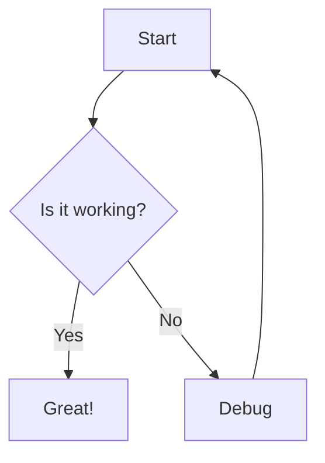
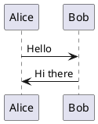

# n8n-nodes-kroki

This is an n8n community node that lets you use [Kroki](https://kroki.io/) diagram conversion service in your n8n workflows.

Kroki is a free, open-source diagram service that creates diagrams from textual descriptions. It supports a wide variety of diagram types including Mermaid, PlantUML, GraphViz, D2, DBML, Excalidraw, and many more, converting them to PNG, SVG, or PDF formats.

[n8n](https://n8n.io/) is a [fair-code licensed](https://docs.n8n.io/reference/license/) workflow automation platform.

[Installation](#installation)  
[Operations](#operations)  
[Compatibility](#compatibility)  
[Usage](#usage)  
[Development](#development)  
[Testing](#testing)  
[Resources](#resources)  
[License](#license)

## Installation

Follow the [installation guide](https://docs.n8n.io/integrations/community-nodes/installation/) in the n8n community nodes documentation.

1. Go to **Settings > Community Nodes** in your n8n instance
2. Select **Install** and enter `n8n-nodes-kroki`
3. Restart your n8n instance if required

Alternatively, you can install via npm:
```bash
npm install n8n-nodes-kroki
```

## Operations

The Kroki node supports diagram conversion with the following operations:

### Diagram Conversion
- **Convert text-based diagrams** to binary image formats (PNG, SVG, PDF)
- **22+ supported diagram types** including:
  - **Mermaid** - Flowcharts, sequence diagrams, Gantt charts, etc.
  - **PlantUML** - UML diagrams, sequence diagrams, class diagrams
  - **GraphViz** - Network diagrams, dependency graphs
  - **D2** - Declarative diagrams with modern styling
  - **DBML** - Database markup language for schema diagrams
  - **Excalidraw** - Hand-drawn style diagrams
  - **C4 PlantUML** - C4 model architecture diagrams
  - **And many more**: ActDiag, BlockDiag, Ditaa, Nomnoml, NwDiag, Pikchr, SeqDiag, Structurizr, Svgbob, TikZ, UMLet, Vega, Vega-Lite, WaveDrom, WireViz

### Configuration Options
- **Server Selection**: Choose between public Kroki service (kroki.io) or custom Kroki server
- **Output Formats**: PNG (image/png), SVG (image/svg+xml), PDF (application/pdf)
- **Timeout Configuration**: Adjustable timeout (1-300 seconds) for large diagram processing
- **Error Handling**: Continue on fail option for robust workflow execution

## Compatibility

- **Minimum n8n version**: 1.0.0
- **Node.js version**: 20.15 or higher
- **Tested with**: n8n 1.82.0 and latest stable versions
- **TypeScript**: Compiled to ES2019 for broad compatibility

## Usage

### Basic Diagram Conversion

1. **Add the Kroki node** to your workflow
2. **Select diagram type** from the dropdown (e.g., Mermaid, PlantUML)
3. **Choose output format** (PNG, SVG, or PDF)
4. **Input diagram source** as text (can be from previous nodes or manual input)
5. **Configure server** (use default public service or specify custom server)
6. **Execute** - The node outputs binary data that can be saved or processed further

### Example: Mermaid Flowchart


### Example: PlantUML Sequence Diagram


### Advanced Usage

- **Dynamic diagram generation**: Use expressions to generate diagrams from workflow data
- **Batch processing**: Process multiple diagrams in a single workflow
- **Integration with other nodes**: Combine with file storage, email, or documentation tools
- **Custom servers**: Use private Kroki instances for enterprise deployments

For more examples and detailed usage instructions, see the [docs/designs/use_cases.md](docs/designs/use_cases.md) file.

## Development

This project follows the standard n8n community node development practices with TypeScript and build automation.

### Prerequisites

* [git](https://git-scm.com/downloads)
* Node.js and npm (minimum version Node 20.15)
* Install n8n globally: `npm install n8n -g`

### Setup

1. Clone the repository:
   ```bash
   git clone https://github.com/RustedVikingOG/n8n-nodes-kroki.git
   cd n8n-nodes-kroki
   ```

2. Install dependencies:
   ```bash
   npm install
   ```

3. Build the project:
   ```bash
   npm run build
   ```

4. Link for local development:
   ```bash
   npm link
   cd ~/.n8n/nodes
   npm link n8n-nodes-kroki
   ```

### Development Commands

- `npm run build` - Build TypeScript and copy assets
- `npm run dev` - Watch mode for development
- `npm run lint` - Check for linting errors
- `npm run lintfix` - Automatically fix linting errors
- `npm run format` - Format code with Prettier

### Project Structure

```
├── nodes/Kroki/          # Kroki node implementation
│   ├── Kroki.node.ts     # Main node logic
│   └── kroki.svg         # Node icon
├── n8n_test_env/         # Docker testing environment
├── docs/                 # Documentation and architecture
├── dist/                 # Compiled output
└── package.json          # Package configuration
```

## Testing

### Local Testing with Docker

The project includes a Docker-based testing environment for comprehensive integration testing:

1. **Start the test environment**:
   ```bash
   cd n8n_test_env
   docker-compose -f compose.n8n-service.yaml up
   ```

2. **Access n8n interface**: Open http://localhost:5678

3. **Test the Kroki node** in real workflows with various diagram types

### Manual Testing

1. **Install the node locally** (see Development section)
2. **Create test workflows** in n8n with different diagram types
3. **Verify output formats** (PNG, SVG, PDF) are generated correctly
4. **Test error scenarios** (invalid syntax, network issues, timeouts)

For detailed testing procedures and use cases, see [docs/designs/use_cases.md](docs/designs/use_cases.md).

## Resources

* [n8n community nodes documentation](https://docs.n8n.io/integrations/#community-nodes)
* [Kroki official documentation](https://kroki.io/docs/)
* [Supported diagram types](https://kroki.io/#support)
* [Project architecture documentation](docs/designs/architecture.md)
* [Collaboration guide](docs/1.COLLABORATION.md)

## License

[MIT](LICENSE.md)
