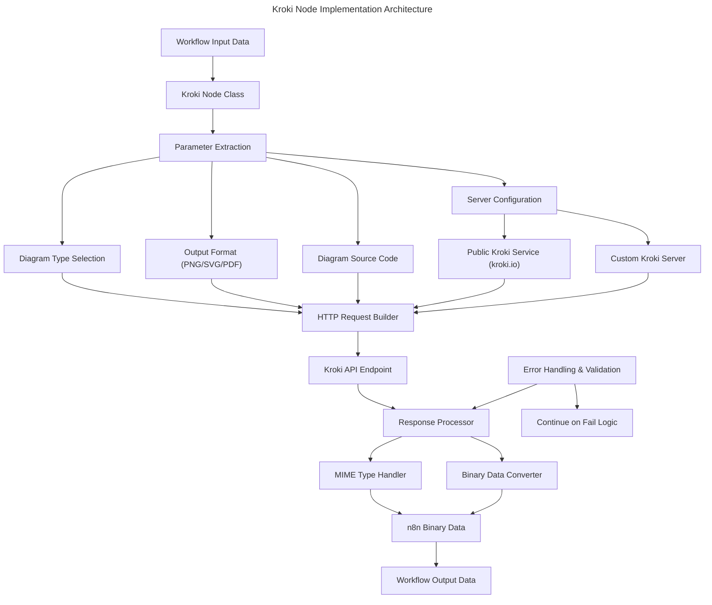
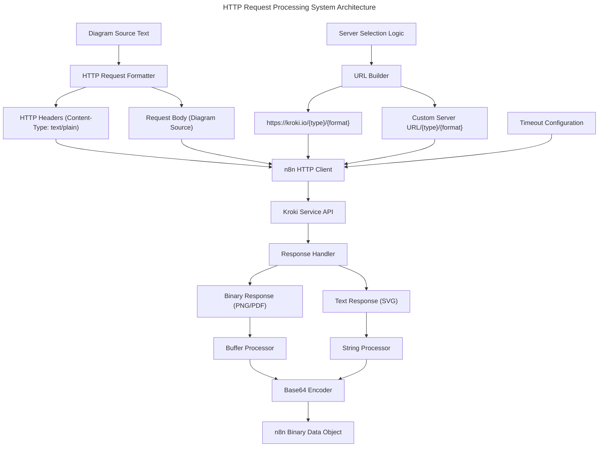
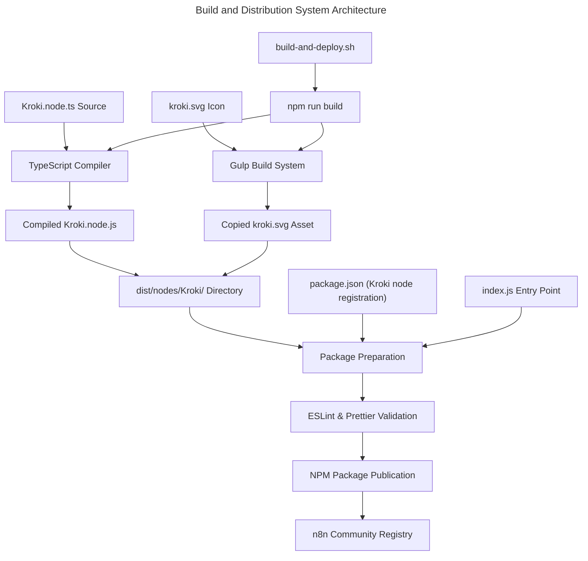
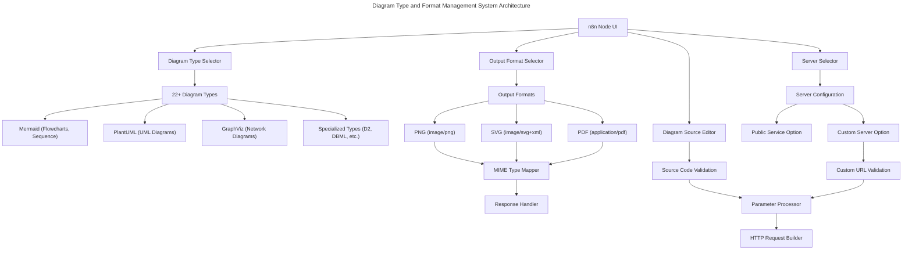
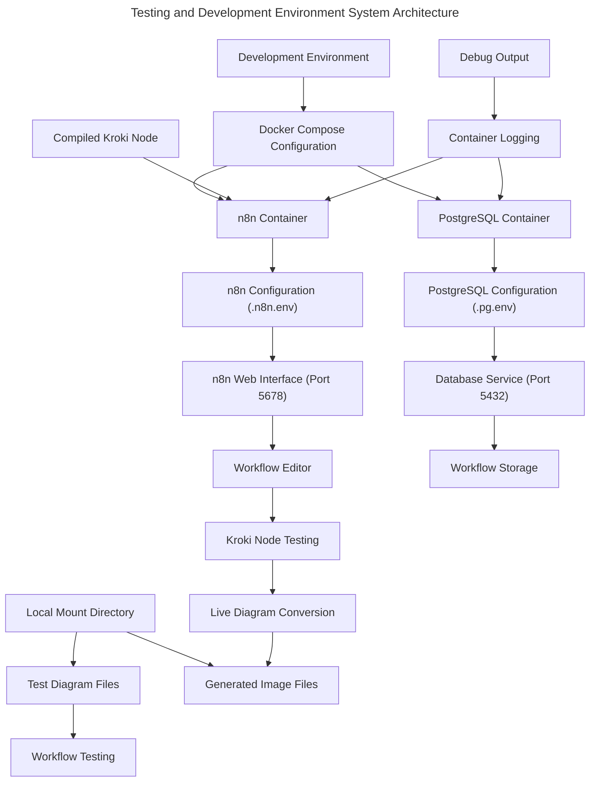

# n8n-nodes-kroki Architecture

This document contains the architectural design of the n8n-nodes-kroki solution with the focus on the high level components and how they interact. The architecture follows the n8n community node package structure with TypeScript-based Kroki diagram conversion, external API integration, and build automation.

## High-level Component definitions & use

Describes the definitions and use of each component in the design, its technology and the scope of the use of any services.

**System components**

**Kroki Node Implementation Layer**

The Kroki Node Implementation Layer consists of the TypeScript class that implements the INodeType interface, providing diagram conversion functionality from text-based sources to binary image formats using the Kroki API service.

**Core Functionality: Kroki Node Implementation Layer**

- **Diagram Type Selection**: Supports 22+ diagram types including Mermaid, PlantUML, GraphViz, D2, DBML, Excalidraw, and specialized formats
- **Format Conversion**: Converts diagrams to PNG, SVG, or PDF formats with appropriate MIME type handling
- **Server Configuration**: Supports both public Kroki service (kroki.io) and custom Kroki server deployments
- **Binary Data Processing**: Handles HTTP response conversion to n8n binary data format with base64 encoding

**Architecture Diagram of component: Kroki Node Implementation Layer**



**HTTP Request Processing System**

The HTTP Request Processing System manages the communication with Kroki API services, handling request formatting, timeout management, and response processing for diagram conversion operations.

**Core Functionality: HTTP Request Processing System**

- **Request Construction**: Builds HTTP POST requests with diagram source as plain text body to Kroki API endpoints
- **Server Management**: Supports both public Kroki service and custom server deployments with URL validation
- **Timeout Handling**: Configurable timeout settings (1-300 seconds) for large diagram processing operations
- **Response Processing**: Handles binary response data (PNG/PDF) and text responses (SVG) with appropriate encoding

**Architecture Diagram of component: HTTP Request Processing System**



**Build and Distribution System**

The Build and Distribution System manages the compilation of TypeScript source code, asset copying, and npm package preparation for the Kroki node distribution. It uses TypeScript compiler, Gulp for asset management, and npm for package publishing.

**Core Functionality: Build and Distribution System**

- **TypeScript Compilation**: Compiles Kroki node TypeScript source to JavaScript ES2019 with strict type checking
- **Asset Management**: Copies kroki.svg icon file from source to distribution directory using Gulp
- **Package Preparation**: Prepares npm package structure with compiled Kroki node and metadata
- **Quality Assurance**: Runs ESLint validation and Prettier formatting with n8n-specific rules before publication

**Architecture Diagram of component: Build and Distribution System**


    IconAssets["SVG/PNG Icon Assets"] --> GulpBuild["Gulp Build System"]
    
    TypeScriptCompiler --> CompiledJS["Compiled JavaScript (ES2019)"]
    GulpBuild --> CopiedAssets["Copied Icon Assets"]
    
    CompiledJS --> DistDirectory["dist/ Directory"]
    CopiedAssets --> DistDirectory
    
    DistDirectory --> PackagePrep["Package Preparation"]
    PackageMetadata["package.json Metadata"] --> PackagePrep
    
    PackagePrep --> QualityCheck["ESLint & Prettier Validation"]
    QualityCheck --> NPMPublish["NPM Package Publication"]
    
    NPMPublish --> CommunityRegistry["n8n Community Registry"]
```

**Diagram Type and Format Management System**

The Diagram Type and Format Management System provides the UI configuration, parameter validation, and format mapping for the extensive range of diagram types and output formats supported by the Kroki service.

**Core Functionality: Diagram Type and Format Management System**

- **Type Selection**: Provides dropdown selection for 22+ diagram types with descriptions (Mermaid, PlantUML, GraphViz, etc.)
- **Format Mapping**: Maps output formats (PNG, SVG, PDF) to appropriate MIME types and file extensions
- **Parameter Validation**: Validates diagram source code, server URLs, and configuration options
- **Dynamic UI**: Provides conditional display logic for custom server configuration options

**Architecture Diagram of component: Diagram Type and Format Management System**



**Testing and Development Environment System**

The Testing and Development Environment System provides Docker-based local testing capabilities for the Kroki node integration with n8n, including containerized n8n instance with PostgreSQL backend for comprehensive testing.

**Core Functionality: Testing and Development Environment System**

- **Docker Environment**: Provides containerized n8n instance with PostgreSQL database for local testing
- **Service Orchestration**: Uses Docker Compose to manage n8n and database services with proper networking
- **Environment Configuration**: Manages environment variables for n8n configuration and database connection
- **Local Testing**: Enables testing of Kroki node integration without external dependencies

**Architecture Diagram of component: Testing and Development Environment System**


