# n8n-nodes-kroki Use Cases

This document defines the specific use cases implemented in the n8n-nodes-kroki project. Each use case represents a specific diagram conversion functionality that can be executed within n8n workflows using the Kroki service.

**project directories**
- nodes/Kroki/ - Kroki diagram conversion node implementation with 22+ supported diagram types
- n8n_test_env/ - Docker-based testing environment for local n8n integration testing
- docs/designs/ - Architecture and use case documentation for the Kroki integration

The n8n-nodes-kroki project provides comprehensive diagram conversion functionality through the Kroki service, supporting over 20 diagram types (Mermaid, PlantUML, GraphViz, D2, DBML, etc.) with multiple output formats (PNG, SVG, PDF). The node integrates with both public Kroki service and custom server deployments, providing flexible binary data output for workflow automation.

## USE-CASE: Diagram Source to Image Conversion

**Feature 1: Multi-format Diagram Conversion with Kroki API Integration**

|| definition |
|--|--|
| GIVEN | A workflow with diagram source code text and user-configured diagram type and output format |
| WHEN | The Kroki node executes with the specified parameters and makes an HTTP request to Kroki service |
| THEN | The diagram source is converted to the specified format (PNG/SVG/PDF) and returned as n8n binary data |

**State Diagram: Logic flow within feature**

The state diagram shows the progression from parameter validation through API request to binary data conversion, including error handling states.

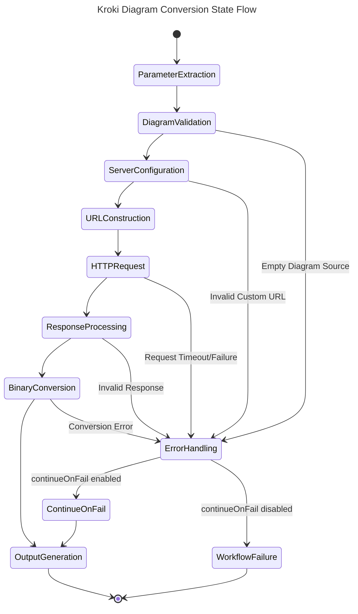

**Sequence Diagram: Interactions between systems to enable Feature**

The sequence diagram illustrates the interaction between the n8n workflow engine, the Kroki node, Kroki API service, and binary data processing components.

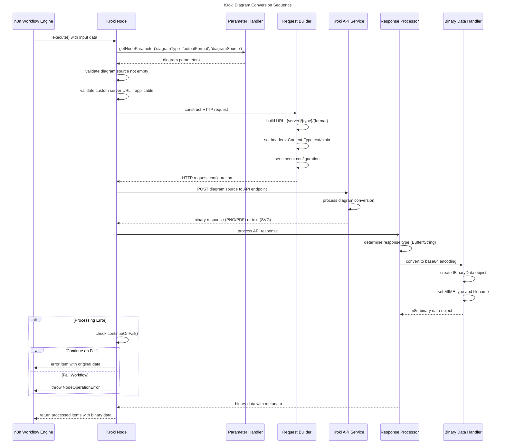

**Data Entity Relationship: Data structure for entities in Feature**

The entity relationship diagram shows the data structures involved in the Kroki diagram conversion processing.

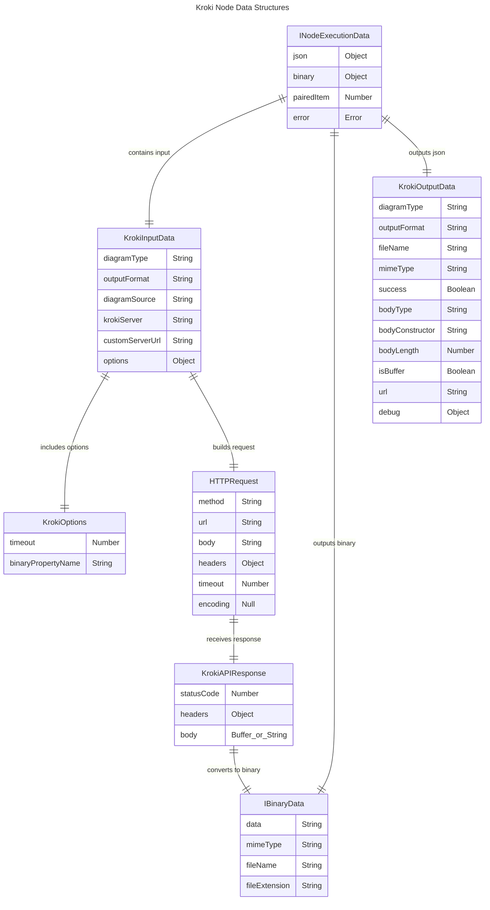
## USE-CASE: Custom Server Configuration and Validation

**Feature 1: Flexible Kroki Server Deployment Support**

|| definition |
|--|--|
| GIVEN | A user needs to use a custom Kroki server deployment instead of the public service |
| WHEN | The Kroki node is configured with custom server option and validated URL |
| THEN | The node successfully connects to the custom server and processes diagram conversions |

**State Diagram: Logic flow within feature**

The state diagram shows the server configuration validation and connection process.

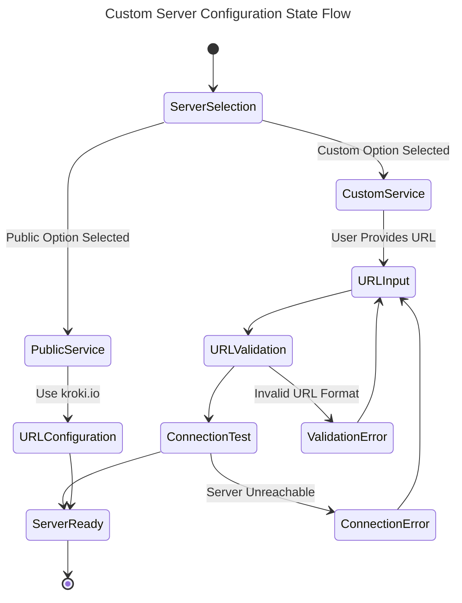

**Sequence Diagram: Interactions between systems to enable Feature**

The sequence diagram illustrates the custom server configuration and validation process.

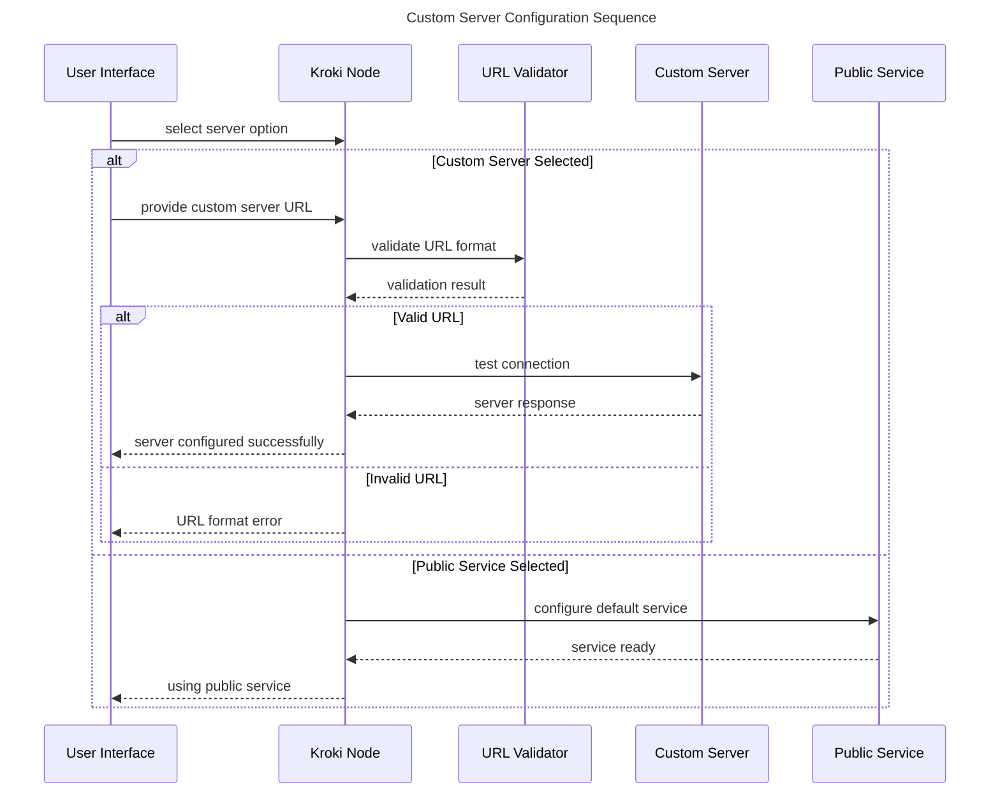

**Data Entity Relationship: Data structure for entities in Feature**

The entity relationship diagram shows the server configuration data structures.

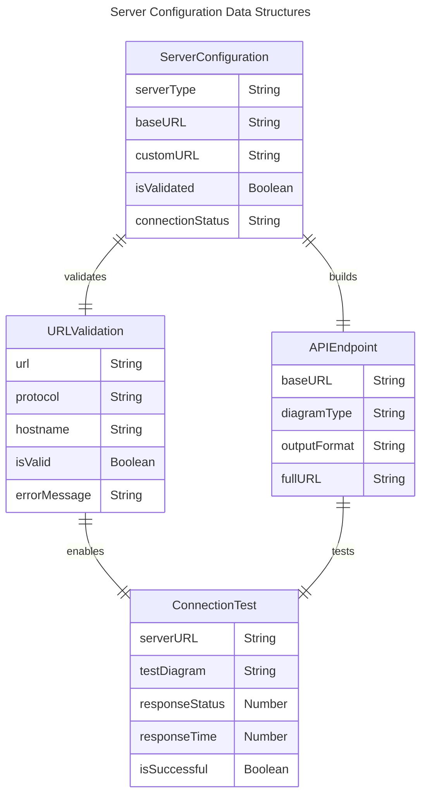

## USE-CASE: Binary Data Processing and Format Handling

**Feature 1: Multi-format Binary Output with MIME Type Management**

|| definition |
|--|--|
| GIVEN | A Kroki API returns diagram data in PNG, SVG, or PDF format |
| WHEN | The response processor handles the binary/text data and converts it for n8n storage |
| THEN | The data is properly encoded, stored with correct MIME type, and made available as workflow binary data |

**State Diagram: Logic flow within feature**

The state diagram shows the binary data processing pipeline from API response to n8n binary storage.

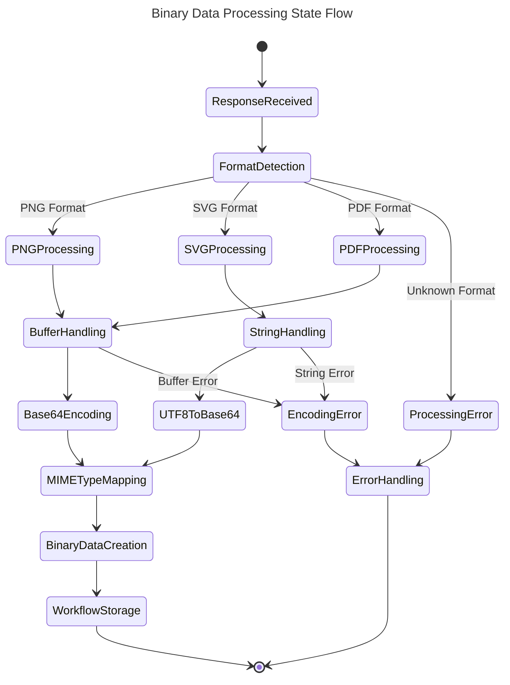

**Sequence Diagram: Interactions between systems to enable Feature**

The sequence diagram illustrates the binary data processing workflow.

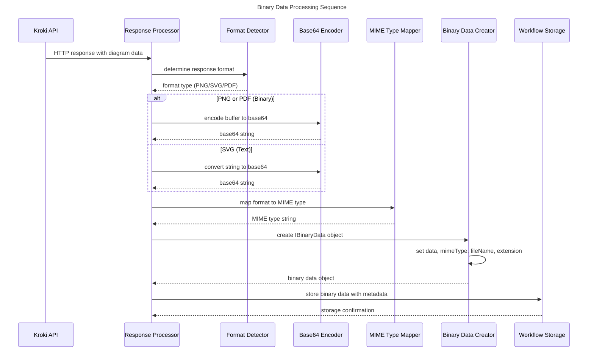

**Data Entity Relationship: Data structure for entities in Feature**

The entity relationship diagram shows the binary data processing structures.

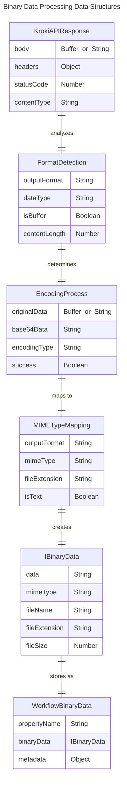

## USE-CASE: Error Handling and Workflow Resilience

**Feature 1: Comprehensive Error Management with Continue-on-Fail Support**

|| definition |
|--|--|
| GIVEN | A workflow encounters errors during diagram conversion (invalid syntax, server issues, etc.) |
| WHEN | The error handling system processes the error based on continueOnFail configuration |
| THEN | The workflow either stops with detailed error information or continues with error data preserved |

**State Diagram: Logic flow within feature**

The state diagram shows the error handling decision process and recovery mechanisms.

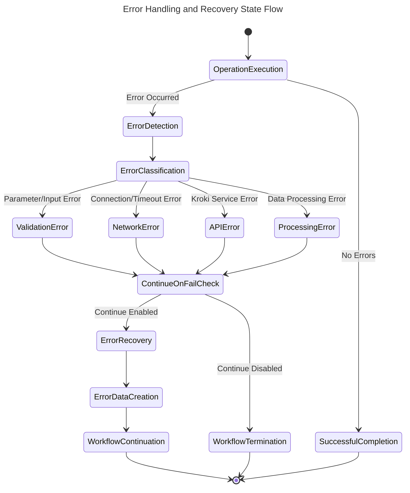

**Sequence Diagram: Interactions between systems to enable Feature**

The sequence diagram illustrates the error handling workflow across system components.

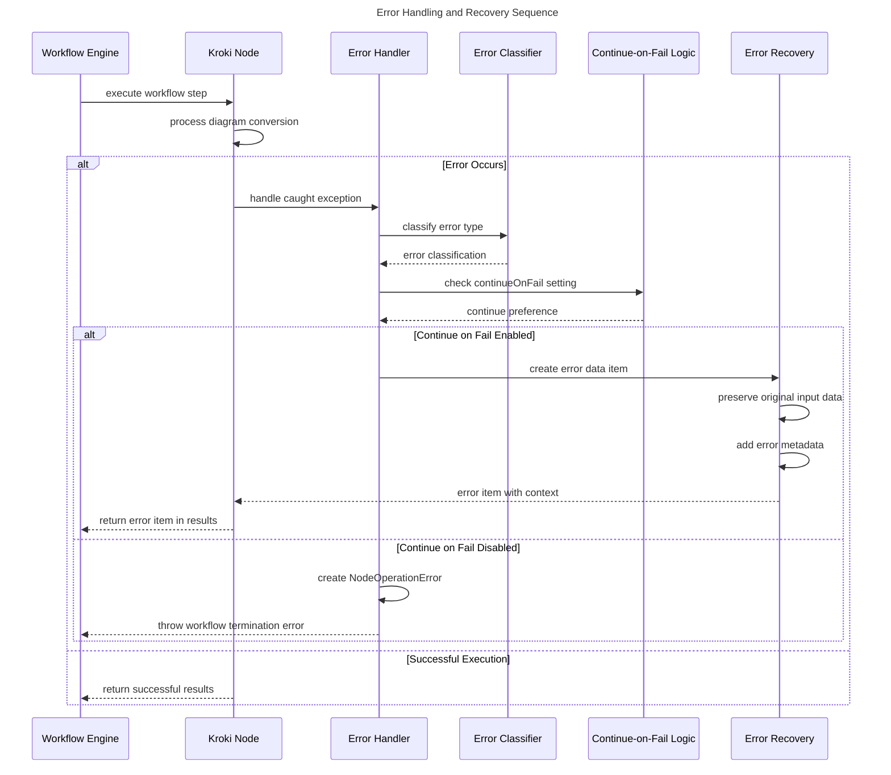

**Data Entity Relationship: Data structure for entities in Feature**

The entity relationship diagram shows the error handling data structures and relationships.

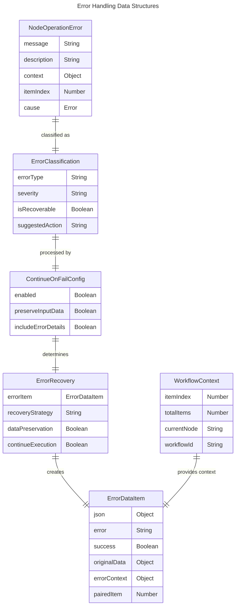
````
    
    Build->>Prettier: format code files
    Prettier-->>Build: formatted code
    
    Build->>Pub: prepare for publication
    Pub->>ESLint: run pre-publish validation
    ESLint-->>Pub: final validation result
    
    alt Pre-publish Validation Passed
        Pub-->>Dev: ready for npm publish
    else Pre-publish Validation Failed
        Pub-->>Dev: publication blocked
    end
```

**Data Entity Relationship: Data structure for entities in Feature**

The entity relationship diagram shows the code quality configuration and validation structures.

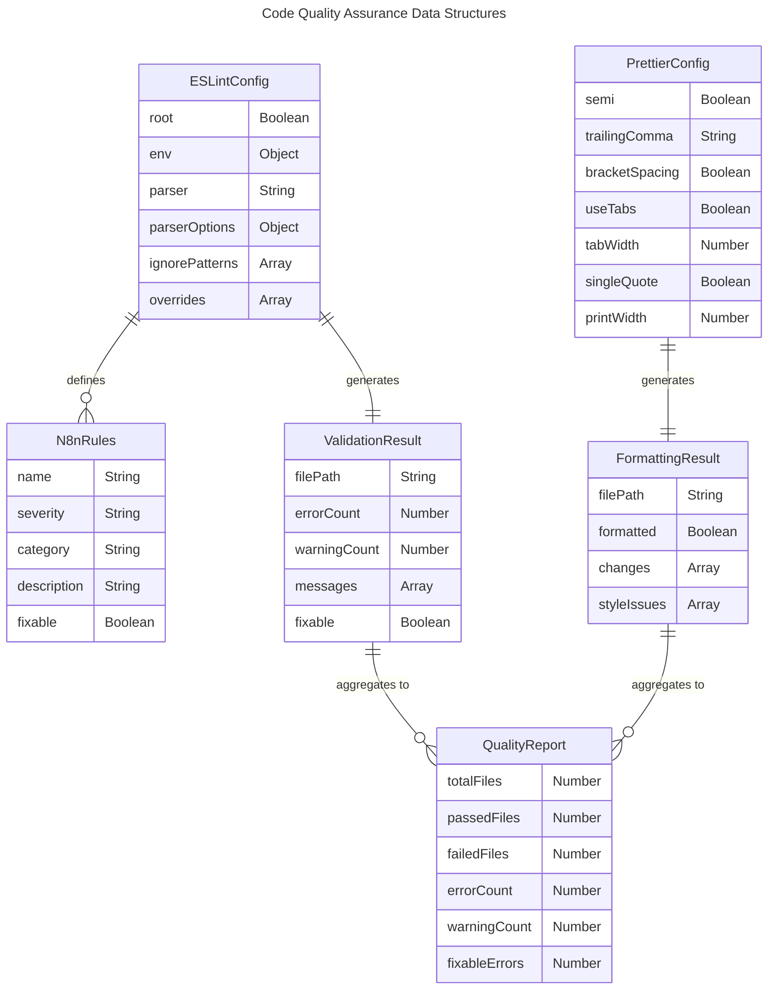
